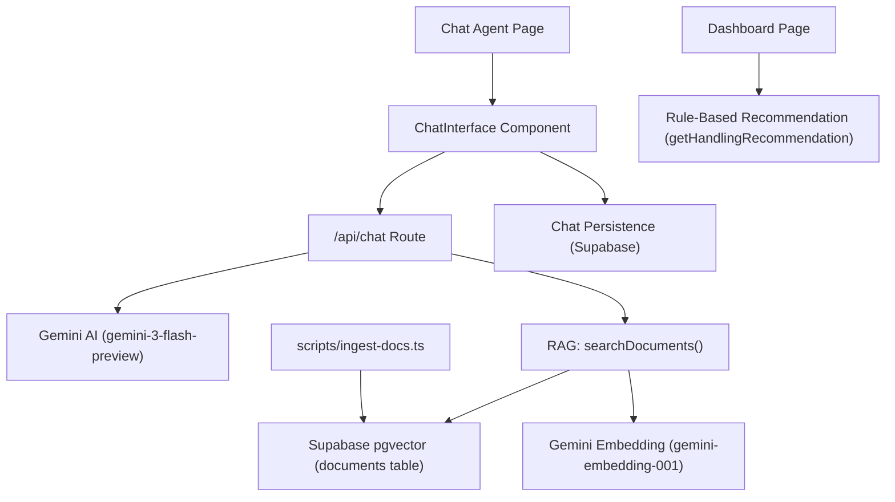

# 🔍 Analisis Sistem AI Recommendation — Shrimpie

## Arsitektur Saat Ini



## Komponen yang Di-review

| # | File | Fungsi |
|---|------|--------|
| 1 | [route.ts](file:///home/najmi/TA/shrimpie/src/app/api/chat/route.ts) | API endpoint chat + streaming |
| 2 | [embeddings.server.ts](file:///home/najmi/TA/shrimpie/src/lib/rag/embeddings.server.ts) | RAG search (server-side) |
| 3 | [embeddings.ts](file:///home/najmi/TA/shrimpie/src/lib/rag/embeddings.ts) | RAG search (client-side, **unused**) |
| 4 | [chat-persistence.ts](file:///home/najmi/TA/shrimpie/src/lib/chat/chat-persistence.ts) | CRUD riwayat chat |
| 5 | [ChatInterface.tsx](file:///home/najmi/TA/shrimpie/src/components/chat/ChatInterface.tsx) | UI chat component |
| 6 | [page.tsx (chat-agent)](file:///home/najmi/TA/shrimpie/src/app/chat-agent/page.tsx) | Halaman chat agent |
| 7 | [page.tsx (dashboard)](file:///home/najmi/TA/shrimpie/src/app/dashboard/page.tsx) | Dashboard + Rule-based Recommendation |
| 8 | [ingest-docs.ts](file:///home/najmi/TA/shrimpie/scripts/ingest-docs.ts) | Script ingestion dokumen RAG |

---

## ⚠️ Kekurangan yang Ditemukan

### 1. 🔴 **KEAMANAN: API Chat Tidak Ada Autentikasi**

[route.ts:19](file:///home/najmi/TA/shrimpie/src/app/api/chat/route.ts#L19)

API endpoint `/api/chat` **tidak memvalidasi user yang login**. Siapa saja bisa mengirim request POST tanpa token auth. Ini artinya:
- Siapapun bisa menggunakan API Gemini Anda (biaya API ditanggung Anda)
- Tidak ada pembatasan akses per user
- Tidak ada middleware proteksi di Next.js (file `middleware.ts` **tidak ada**)

```diff
 export async function POST(req: Request) {
     try {
+        // Validate authenticated user
+        const supabase = getSupabaseAdmin();
+        const authHeader = req.headers.get('authorization');
+        if (!authHeader) {
+            return new Response(JSON.stringify({ error: 'Unauthorized' }), { status: 401 });
+        }
+
         const { messages, parameters, conversationId } = await req.json();
```

---

### 2. 🔴 **KEAMANAN: Tidak Ada Rate Limiting**

Tidak ditemukan mekanisme rate limiting sama sekali di seluruh codebase. User bisa mengirim request tanpa batas ke:
- `/api/chat` — setiap request mengkonsumsi biaya API Gemini + API Embedding
- RAG search juga dipanggil per chat message

> [!CAUTION]
> Tanpa rate limiting, API Gemini bisa dibobol habis oleh spammer. Tambahkan rate limiter (contoh: `upstash/ratelimit`) dengan batas misalnya 20 request/menit per user.

---

### 3. 🟠 **DOC (Days of Culture) Tidak Dikirim ke AI**

[route.ts:82-115](file:///home/najmi/TA/shrimpie/src/app/api/chat/route.ts#L82-L115)

Dashboard sudah menghitung DOC dari `stocking_date`, tapi **informasi DOC tidak pernah dikirim ke AI Chat Agent**. `chat-agent/page.tsx` mengambil `pond_metrics` tapi **tidak mengambil `stocking_date`** dari tabel `ponds`.

Akibatnya, AI tidak tahu umur udang (DOC) dan tidak bisa memberikan rekomendasi berbasis fase pertumbuhan yang akurat.

```diff
 // Di chat-agent/page.tsx, tambahkan fetch stocking_date
 const pondParameters = {
     avg_weight: latestMetric?.avg_body_weight_g ?? 0,
     avg_length: latestMetric?.avg_body_length_cm ?? 0,
     activity_level: latestMetric?.activity_level_pct ?? 0,
     pondName: selectedPondName || undefined,
     metricsHistory: metrics,
+    stockingDate: stockingDate,  // dari fetch ponds
+    doc: calculatedDOC,          // hitung DOC
 }
```

---

### 4. 🟠 **Rule-Based Recommendation Tidak Terintegrasi dengan AI Chat**

[dashboard/page.tsx:61-101](file:///home/najmi/TA/shrimpie/src/app/dashboard/page.tsx#L61-L101)

Fungsi `getHandlingRecommendation()` di Dashboard adalah rule-based engine yang sudah bagus (berisi SOP feeding, thresholds berat/panjang/aktivitas). Namun:
- Hanya ada di Dashboard, **tidak ada di halaman chat AI**
- AI Chat Agent tidak tahu tentang SOP feeding stages ini
- Tidak ada **sinkronisasi** antara rule-based recommendation dan AI recommendation

> [!IMPORTANT]
> Pertimbangkan untuk menyertakan output rule-based recommendation di dalam system prompt AI, agar AI bisa memberikan rekomendasi yang konsisten dengan SOP.

---

### 5. 🟠 **RAG Knowledge Base Sangat Terbatas**

[docs/](file:///home/najmi/TA/shrimpie/docs/)

Folder `docs/` hanya berisi **1 file PDF** (`Program Pakan.pdf`, ~67KB). Untuk sistem RAG yang efektif, knowledge base perlu diperkaya dengan:
- Panduan kualitas air (DO, pH, salinitas, suhu, ammonia)
- Panduan penanganan penyakit udang (WFD, WSSV, EHP, dll)
- SOP manajemen pakan lengkap
- Panduan panen dan pascapanen
- FAQ umum petambak

---

### 6. 🟡 **Duplikasi Kode RAG: `embeddings.ts` vs `embeddings.server.ts`**

[embeddings.ts](file:///home/najmi/TA/shrimpie/src/lib/rag/embeddings.ts) dan [embeddings.server.ts](file:///home/najmi/TA/shrimpie/src/lib/rag/embeddings.server.ts)

Terdapat 2 file embeddings yang hampir identik:
- `embeddings.ts` — menggunakan browser client, **TIDAK PERNAH digunakan** di mana pun
- `embeddings.server.ts` — menggunakan admin client, yang benar-benar dipakai

> [!TIP]
> `embeddings.ts` (client-side) juga **membocorkan GEMINI_API_KEY** karena `process.env.GEMINI_API_KEY` **tanpa `NEXT_PUBLIC_` prefix** tidak akan tersedia di client. File ini harus dihapus.

---

### 7. 🟡 **Conversation History Dikirim Sebagai Flat Text, Bukan Structured**

[route.ts:131-145](file:///home/najmi/TA/shrimpie/src/app/api/chat/route.ts#L131-L145)

Seluruh conversation history dikirim sebagai string gabungan ke Gemini, bukan menggunakan format multi-turn chat yang didukung Gemini API. Ini menyebabkan:
- Context window tidak efisien
- Model bisa "bingung" membedakan mana prompt mana respons
- Tidak memanfaatkan fitur `chat.sendMessage()` dari Gemini SDK

```diff
-        let fullPrompt = `${systemPrompt}\n\n`;
-        // ... membangun fullPrompt sebagai string
-        const result = await model.generateContentStream(fullPrompt);

+        const chat = model.startChat({
+            history: messages.slice(0, -1).map(m => ({
+                role: m.role === 'assistant' ? 'model' : 'user',
+                parts: [{ text: m.content }],
+            })),
+            systemInstruction: systemPrompt,
+        });
+        const result = await chat.sendMessageStream(currentPrompt);
```

---

### 8. 🟡 **Tidak Ada Validasi Input di API**

[route.ts:21](file:///home/najmi/TA/shrimpie/src/app/api/chat/route.ts#L21)

```typescript
const { messages, parameters, conversationId } = await req.json();
```

Tidak ada validasi:
- `messages` bisa kosong atau bukan array
- `parameters` bisa undefined
- `conversationId` bisa berupa nilai yang tidak valid
- Tidak ada limit panjang pesan (user bisa mengirim pesan yang sangat panjang)

Gunakan library validasi seperti **Zod** (sudah di-install di project) untuk memvalidasi request body.

---

### 9. 🟡 **Welcome Message Berbahasa Inggris, System Prompt Berbahasa Indonesia**

[ChatInterface.tsx:67-81](file:///home/najmi/TA/shrimpie/src/components/chat/ChatInterface.tsx#L67-L81) vs [route.ts:118-129](file:///home/najmi/TA/shrimpie/src/app/api/chat/route.ts#L118-L129)

- Welcome message: `"Hello! I am your **Shrimpie Advisor**."` — **English**
- System prompt: `"Gunakan bahasa Indonesia yang profesional..."` — **Indonesian**
- Placeholder input: `"Ask about shrimp management..."` — **English**
- Metric labels: `"Average Weight"`, `"Average Length"` — **English**

Inkonsistensi bahasa ini membingungkan user. Target user adalah petambak Indonesia, sehingga semua teks harus konsisten berbahasa Indonesia.

---

### 10. 🟡 **Chat Agent Tidak Mengirim DOC/Stocking Date ke System Prompt**

Meskipun system prompt menyebutkan:
> "jika berat di bawah 15 gram **di umur tertentu**, berikan saran pakan"

AI **tidak tahu umur udang** karena DOC/stocking_date tidak pernah dikirim ke API. Ini membuat AI hanya bisa menebak berdasarkan berat saja.

---

### 11. 🟡 **Ingest Script Menggunakan Publishable Key, Bukan Service Role Key**

[ingest-docs.ts:27](file:///home/najmi/TA/shrimpie/scripts/ingest-docs.ts#L27)

```typescript
const supabaseKey = process.env.NEXT_PUBLIC_SUPABASE_PUBLISHABLE_KEY!;
```

Script ingestion seharusnya menggunakan `SUPABASE_SERVICE_ROLE_KEY` karena berjalan di server dan perlu menulis ke tabel `documents`. Publishable key mungkin tidak punya permission INSERT ke tabel `documents` jika RLS diaktifkan.

---

### 12. 🟡 **Tidak Ada Feedback / Rating Sistem**

Tidak ada mekanisme bagi user untuk:
- Memberikan 👍/👎 pada respons AI
- Melaporkan jawaban yang salah
- Memberikan rating kualitas rekomendasi

Feedback loop penting untuk meningkatkan kualitas sistem AI secara iteratif.

---

### 13. 🟡 **Tidak Ada Suggested Questions / Quick Actions**

Chat interface langsung menampilkan kolom input kosong. Untuk UX yang lebih baik:
- Tampilkan **suggested questions** (contoh: "Bagaimana kondisi udang saya?", "Rekomendasi pakan untuk DOC 45", "Analisis trend pertumbuhan")
- Tampilkan **quick actions** berdasarkan data terkini (contoh: jika aktivitas rendah, tampilkan tombol "Analisis penyebab aktivitas rendah")

---

### 14. 🟢 **Chunk Size RAG Terlalu Kecil**

[ingest-docs.ts:21-22](file:///home/najmi/TA/shrimpie/scripts/ingest-docs.ts#L21-L22)

```typescript
const CHUNK_SIZE = 500;  // characters per chunk
const CHUNK_OVERLAP = 100;
```

500 karakter terlalu kecil untuk konteks yang bermakna. Rekomendasi: **1000-1500 karakter** dengan overlap **200-300 karakter** agar setiap chunk mempertahankan konteks yang cukup.

---

### 15. 🟢 **pgvector Index Tidak Ada**

[001_enable_pgvector.sql:12](file:///home/najmi/TA/shrimpie/supabase/migrations/001_enable_pgvector.sql#L12)

```sql
-- Note: vector index skipped because pgvector limits indexes to 2000 dims.
```

Dimensi embedding 3072 (dari Gemini) memang melebihi batas pgvector IVFFlat, tapi ini bisa diatasi dengan **HNSW index** yang mendukung dimensi lebih tinggi, atau pertimbangkan model embedding dengan dimensi lebih kecil (768).

---

### 16. 🟢 **Tidak Ada Error Boundary di Chat Interface**

Jika terjadi error saat streaming, user hanya melihat pesan generik. Tidak ada:
- Tombol "Coba Lagi" untuk mengirim ulang pesan
- Indicator koneksi terputus
- Fallback UI yang informatif

---

## 📊 Ringkasan Prioritas

| Prioritas | Issue | Impact |
|-----------|-------|--------|
| 🔴 Kritis | API tanpa autentikasi | Keamanan, biaya |
| 🔴 Kritis | Tidak ada rate limiting | Keamanan, biaya |
| 🟠 Tinggi | DOC tidak dikirim ke AI | Akurasi rekomendasi |
| 🟠 Tinggi | Rule-based tidak terintegrasi dgn AI | Konsistensi rekomendasi |
| 🟠 Tinggi | RAG knowledge base terlalu terbatas | Kualitas jawaban |
| 🟡 Sedang | Conversation tidak pakai multi-turn | Efisiensi & akurasi |
| 🟡 Sedang | Tidak ada validasi input | Keamanan |
| 🟡 Sedang | Inkonsistensi bahasa | UX |
| 🟡 Sedang | Ingest script pakai publishable key | Keamanan |
| 🟡 Sedang | Tidak ada feedback/rating | Peningkatan kualitas |
| 🟡 Sedang | Tidak ada suggested questions | UX |
| 🟢 Minor | Chunk size terlalu kecil | Kualitas RAG |
| 🟢 Minor | pgvector tanpa index | Performance |
| 🟢 Minor | Tidak ada error retry di UI | UX |
| 🟢 Minor | Dead code (embeddings.ts) | Code hygiene |

---

## 🛠️ Rekomendasi Tindakan (Urutan Prioritas)

### Fase 1: Keamanan (Wajib)
1. Tambahkan **autentikasi** di `/api/chat` — validasi session Supabase
2. Buat **middleware.ts** di root project untuk proteksi semua API routes
3. Implementasi **rate limiting** (contoh: `@upstash/ratelimit` + Redis, atau simple in-memory limiter)
4. Validasi request body dengan **Zod schema**

### Fase 2: Akurasi AI (Sangat Dianjurkan)
5. Kirim **DOC dan stocking_date** ke AI system prompt
6. Integrasikan output **rule-based recommendation** ke dalam system prompt AI
7. Gunakan **multi-turn chat** via Gemini SDK (`startChat()`) bukan flat string
8. Perkaya **knowledge base RAG** (tambah dokumen penyakit, kualitas air, manajemen pakan)

### Fase 3: UX & Polish
9. Konsistenkan semua teks ke **Bahasa Indonesia**
10. Tambahkan **suggested questions** di awal chat
11. Tambahkan **tombol retry** di chat ketika error
12. Implementasi **feedback system** (👍/👎)

### Fase 4: Optimasi
13. Hapus file **embeddings.ts** (dead code)
14. Perbesar **chunk size** RAG menjadi ~1000 karakter
15. Pertimbangkan model embedding dengan **dimensi lebih kecil** (768) + HNSW index
